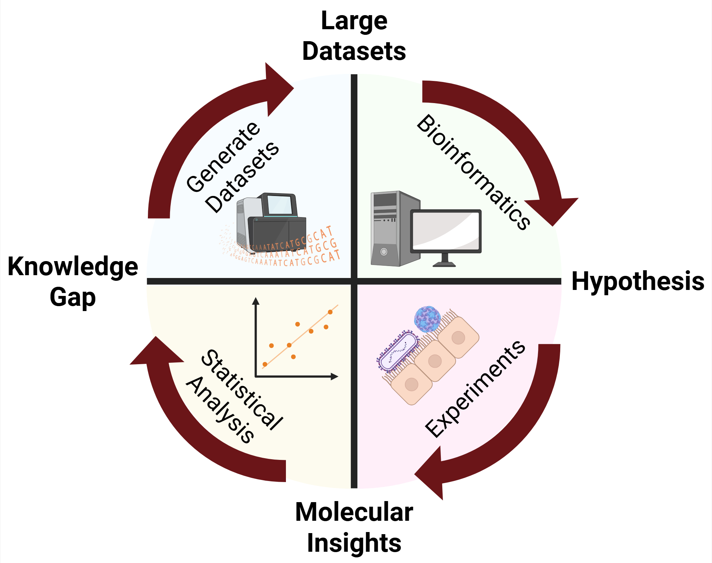

---
---

# Griffiths Lab Website

The Airway Systems Virology Lab combines systems biology and molecular biology to investigate how host-cell gene regulatory landscapes impact susceptibility and responses to respiratory viral infection. Guided by a “Data Science-Based Systems Virology” philosophy (schematic below), the lab blends bioinformatics with wet-lab experiments and clinical collaboration to tackle basic virology questions with human health importance.



## Highlights



Current projects focus on 1) How children with asthma respond to rhinovirus infection 2) Differences in intrinsic susceptibility to infection in respiratory epithelial cells.









The lab prioritizes enthusiasm for scientific discovery and willingness to learn new things. Come join our growing team!






